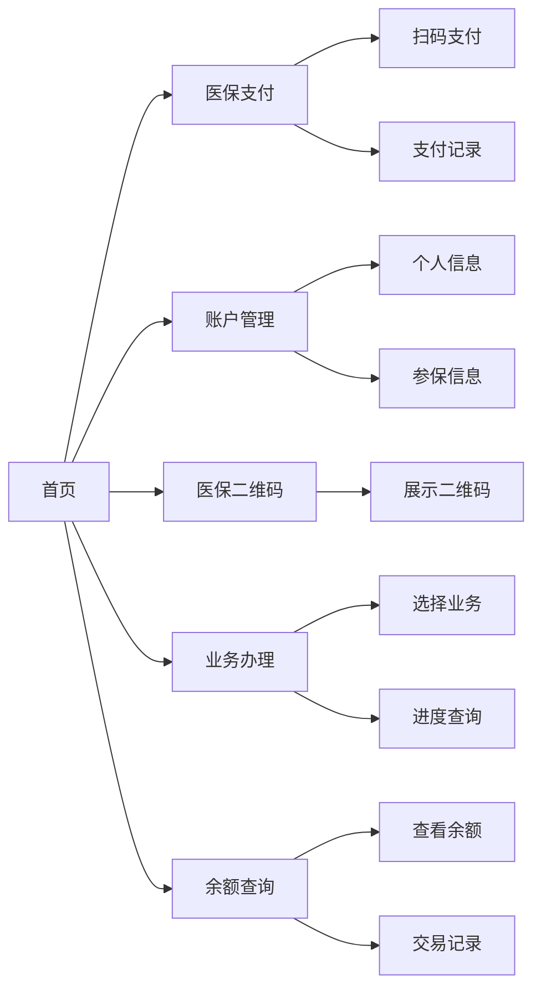

## 1. 产品概述

本项目是一个仿支付宝医保小程序的网页版应用，为用户提供便捷的医保服务入口，包括医保支付、账户管理、医保二维码、业务办理、余额查询等核心功能。

- 主要目的：简化医保业务办理流程，让用户随时随地查询和使用医保服务
- 目标用户：参加社会医疗保险的所有参保人员
- 产品价值：提升医保服务的可及性和便捷性，减少线下排队等待时间

## 2. 核心功能

### 2.1 用户角色

| 角色 | 注册方式 | 核心权限 |
|------|----------|----------|
| 参保用户 | 手机号/身份证登录 | 查询医保账户、使用医保支付、办理医保业务 |

### 2.2 功能模块

1. **首页**：账户概览、快捷功能入口、常用服务推荐
2. **医保支付**：扫码支付、订单记录、支付详情
3. **账户管理**：个人信息、参保信息、账户明细
4. **医保二维码**：动态二维码展示、刷码使用说明
5. **业务办理**：在线办理医保相关业务、办理进度查询
6. **余额查询**：账户余额、消费记录、缴费记录

### 2.3 页面详情

| 页面名称 | 模块名称 | 功能描述 |
|---------|----------|----------|
| 首页 | 账户概览 | 显示医保账户余额、参保状态 |
| 首页 | 快捷功能区 | 医保支付、二维码、余额查询、业务办理快捷入口 |
| 首页 | 服务推荐 | 常用医保服务推荐列表 |
| 医保支付页 | 扫码支付 | 扫码完成医保支付流程 |
| 医保支付页 | 支付记录 | 历史支付订单列表和详情 |
| 账户管理页 | 个人信息 | 姓名、身份证号、联系方式等 |
| 账户管理页 | 参保信息 | 参保单位、缴费基数、参保状态 |
| 账户管理页 | 账户明细 | 收入和支出明细记录 |
| 医保二维码页 | 二维码展示 | 动态医保电子凭证二维码 |
| 医保二维码页 | 使用说明 | 二维码使用场景和注意事项 |
| 业务办理页 | 业务列表 | 可办理的医保业务列表 |
| 业务办理页 | 办理进度 | 已提交业务的办理状态 |
| 余额查询页 | 余额展示 | 医保账户各分项余额 |
| 余额查询页 | 交易记录 | 消费和缴费记录查询 |

## 3. 核心流程

用户打开应用后，首先进入首页查看账户概览，然后可以通过快捷功能入口进入各个功能模块。

## 4. 用户界面设计

### 4.1 设计风格

- 主色调：医保蓝（#1A73E8），代表信任和专业
- 辅助色：医疗绿（#34A853），代表健康和安全
- 强调色：橙色（#FB923C），用于重要操作按钮
- 按钮风格：圆角矩形，带有轻微阴影，hover时有上浮效果
- 字体：使用"PingFang SC"作为主要字体，配合"Noto Sans SC"
- 布局风格：卡片式布局，顶部导航栏，底部功能标签栏
- 图标风格：使用lucide-react线性图标，简洁现代

### 4.2 页面设计概述

| 页面名称 | 模块名称 | UI元素 |
|---------|----------|--------|
| 首页 | 账户概览 | 渐变背景卡片、余额数字动画、参保状态标签 |
| 首页 | 快捷功能区 | 4宫格图标导航、点击涟漪效果 |
| 首页 | 服务推荐 | 横向滚动卡片列表 |
| 医保支付页 | 扫码区域 | 模拟扫码框动画、闪光灯效果 |
| 医保支付页 | 支付记录 | 时间轴式列表、金额高亮 |
| 账户管理页 | 信息卡片 | 头像区域、可编辑字段、分组展示 |
| 医保二维码页 | 二维码区域 | 居中大尺寸二维码、动态刷新动画 |
| 业务办理页 | 业务列表 | 分类标签、业务卡片带办理状态 |
| 余额查询页 | 余额展示 | 环形进度图、分项余额卡片 |

### 4.3 响应式设计

- 采用桌面优先设计，同时适配平板和移动设备
- 桌面端：侧边栏导航 + 主内容区
- 移动端：底部标签栏导航 + 垂直内容流
- 断点：768px（平板）、480px（手机）
- 触摸优化：按钮最小高度44px，间距适配手指操作

### 4.4 交互动效

- 页面切换：平滑的淡入淡出和滑动过渡
- 卡片悬停：轻微上浮+阴影加深
- 数据加载：骨架屏和脉冲动画
- 按钮点击：缩放反馈效果
- 数字变化：滚动计数动画
