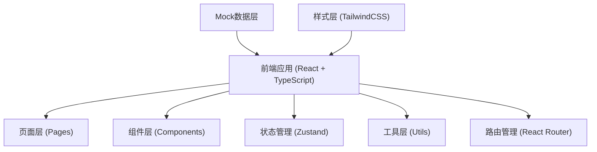
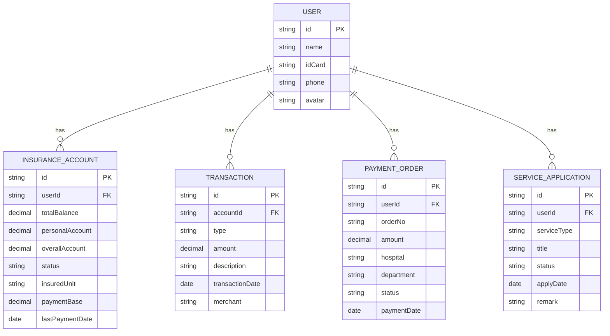

## 1. 架构设计



## 2. 技术描述

- 前端框架：React@18 + TypeScript
- 构建工具：Vite@5
- 路由管理：react-router-dom@6
- 状态管理：zustand@4
- 样式方案：TailwindCSS@3
- UI组件库：lucide-react（图标）
- 二维码生成：qrcode.react
- 图表库：recharts（用于数据可视化）
- 后端：无（纯前端项目，使用Mock数据）
- 数据：本地Mock数据 + localStorage存储

## 3. 路由定义

| 路由路径 | 页面名称 | 用途 |
|---------|----------|------|
| / | 首页 | 账户概览、快捷功能入口 |
| /payment | 医保支付 | 扫码支付、支付记录 |
| /account | 账户管理 | 个人信息、参保信息 |
| /qrcode | 医保二维码 | 电子凭证二维码展示 |
| /services | 业务办理 | 医保业务办理列表 |
| /balance | 余额查询 | 账户余额、交易记录 |

## 4. 数据模型

### 4.1 数据模型定义



### 4.2 核心数据类型定义

```typescript
// 用户信息
interface User {
  id: string;
  name: string;
  idCard: string;
  phone: string;
  avatar: string;
}

// 医保账户
interface InsuranceAccount {
  id: string;
  userId: string;
  totalBalance: number;
  personalAccount: number;
  overallAccount: number;
  status: 'normal' | 'suspended' | 'cancelled';
  insuredUnit: string;
  paymentBase: number;
  lastPaymentDate: string;
}

// 交易记录
interface Transaction {
  id: string;
  accountId: string;
  type: 'income' | 'expense';
  amount: number;
  description: string;
  transactionDate: string;
  merchant: string;
}

// 支付订单
interface PaymentOrder {
  id: string;
  userId: string;
  orderNo: string;
  amount: number;
  hospital: string;
  department: string;
  status: 'pending' | 'success' | 'failed' | 'refunded';
  paymentDate: string;
}

// 业务申请
interface ServiceApplication {
  id: string;
  userId: string;
  serviceType: string;
  title: string;
  status: 'draft' | 'reviewing' | 'approved' | 'rejected' | 'completed';
  applyDate: string;
  remark: string;
}

// 医保业务类型
interface InsuranceService {
  id: string;
  name: string;
  description: string;
  icon: string;
  category: string;
  requiredMaterials: string[];
  estimatedTime: string;
}
```

## 5. 项目结构

```
src/
├── components/          # 公共组件
│   ├── Layout/         # 布局组件
│   ├── Card/           # 卡片组件
│   ├── Navbar/         # 导航栏
│   ├── TabBar/         # 底部标签栏
│   ├── EmptyState/     # 空状态
│   └── Loading/        # 加载组件
├── pages/              # 页面组件
│   ├── Home/           # 首页
│   ├── Payment/        # 医保支付
│   ├── Account/        # 账户管理
│   ├── Qrcode/         # 医保二维码
│   ├── Services/       # 业务办理
│   └── Balance/        # 余额查询
├── store/              # 状态管理
│   └── useStore.ts
├── data/               # Mock数据
│   └── mockData.ts
├── utils/              # 工具函数
│   ├── format.ts       # 格式化工具
│   └── storage.ts      # 本地存储
├── types/              # 类型定义
│   └── index.ts
├── App.tsx             # 根组件
├── main.tsx            # 入口文件
└── index.css           # 全局样式
```

## 6. 核心功能实现方案

### 6.1 医保二维码
- 使用 `qrcode.react` 库生成动态二维码
- 二维码内容包含用户ID和时间戳，每60秒自动刷新
- 增加安全防护，截图检测提示

### 6.2 余额可视化
- 使用 `recharts` 库实现环形进度图展示各分项余额占比
- 交易记录支持按时间范围和类型筛选
- 数字滚动动画增强视觉体验

### 6.3 扫码支付
- 模拟扫码界面，使用CSS动画实现扫描线效果
- 支付流程包含：扫码 → 确认订单 → 输入密码 → 支付成功
- 支付密码使用虚拟键盘输入

### 6.4 状态管理
- 使用 `zustand` 管理全局状态（用户信息、账户数据）
- 使用 `localStorage` 持久化用户操作数据
- 页面数据优先从store获取，无数据时加载Mock数据
